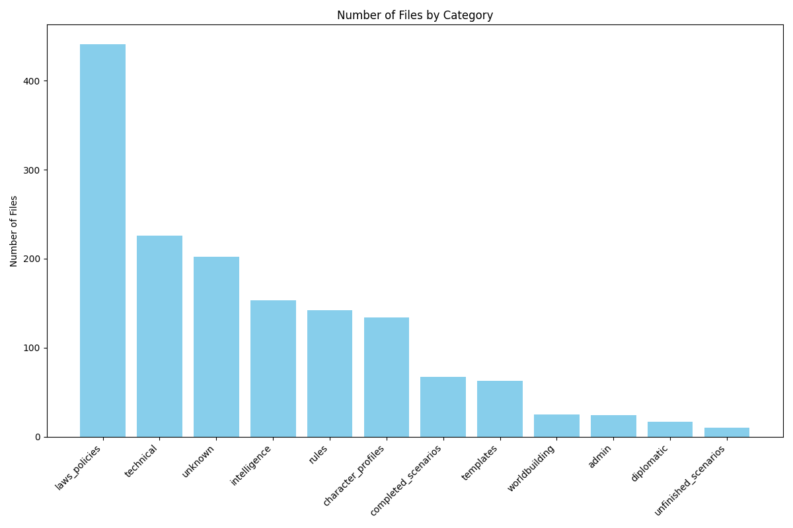
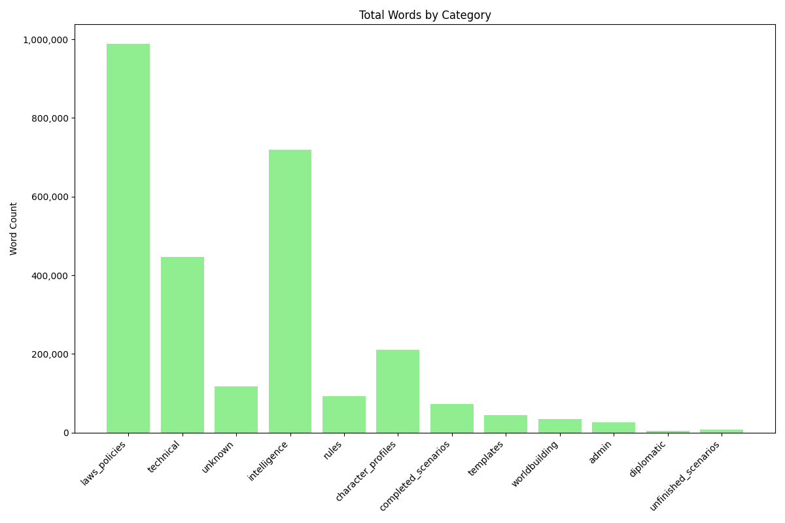
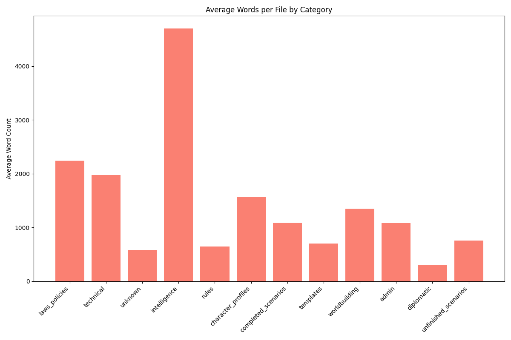
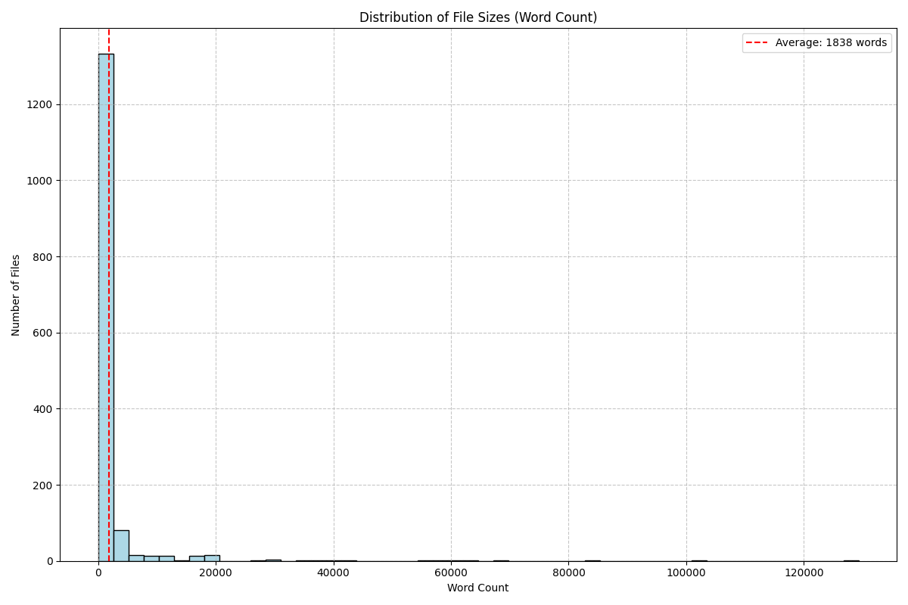
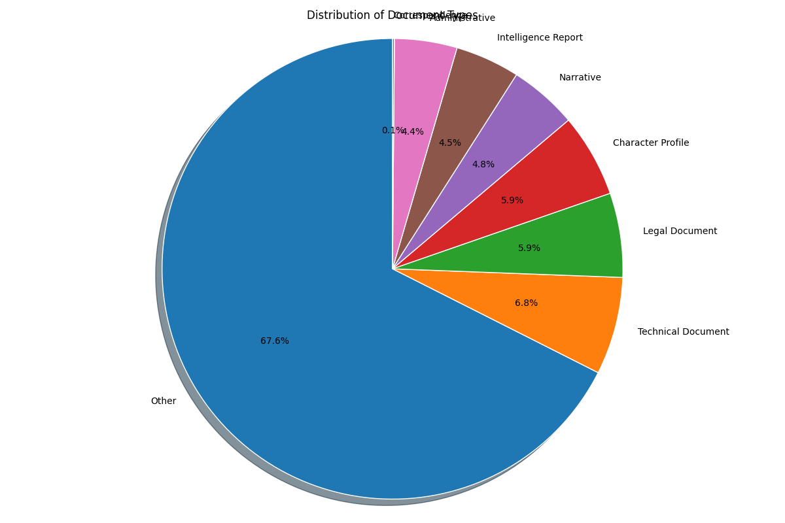

# EOTIR LLM Dataset Statistics

## Overall Statistics

- **Total Files**: 1,504
- **Total Words**: 2,764,056
- **Average Words per File**: 1837.8

## Category Statistics

| Category | Files | Total Words | Avg Words/File |
|----------|-------|-------------|----------------|
| in_game_documents/laws_policies | 441 | 988,595 | 2241.7 |
| in_game_documents/technical | 226 | 446,955 | 1977.7 |
| unknown | 202 | 117,749 | 582.9 |
| in_game_documents/intelligence | 153 | 719,628 | 4703.5 |
| ooc_content/rules | 142 | 92,206 | 649.3 |
| character_profiles | 134 | 209,912 | 1566.5 |
| narratives/completed_scenarios | 67 | 72,680 | 1084.8 |
| ooc_content/templates | 63 | 44,033 | 698.9 |
| worldbuilding | 25 | 33,752 | 1350.1 |
| ooc_content/admin | 24 | 25,976 | 1082.3 |
| in_game_documents/diplomatic | 17 | 4,994 | 293.8 |
| narratives/unfinished_scenarios | 10 | 7,576 | 757.6 |

## Data Distribution

## File Size Distribution

The dataset includes files of various sizes, from small documents with fewer than 100 words to large documents with several thousand words.

### Largest Files

| Category | File | Word Count |
|----------|------|------------|
| in_game_documents/technical | External_Stuff_0990_p5_NAVY_SHIPS_DIRECTORY_BATTLESHIPS_pdf.txt | 129,307 |
| in_game_documents/technical | External_Stuff_0990_p5_NAVY_SHIPS_DIRECTORY_SHIP_AVAILABILITY_DATABASE_LEGACY_FILE_pdf.txt | 101,595 |
| in_game_documents/technical | External_Stuff_Org_Charts_Military_Police_Operations_Manual_pdf.txt | 84,811 |
| in_game_documents/intelligence | External_Stuff_Org_Charts_LAPD_Reports_boi_rand_03_03_31_pdf.txt | 67,244 |
| in_game_documents/intelligence | External_Stuff_Org_Charts_LAPD_Reports_city_compliance_report_1_pdf.txt | 62,086 |
| in_game_documents/intelligence | External_Stuff_Org_Charts_LAPD_Reports_Website_Report__Jan__-_June_2008_pdf.txt | 59,589 |
| in_game_documents/intelligence | External_Stuff_Org_Charts_LAPD_Reports_consent_decree_mental_ill_append_pdf.txt | 59,075 |
| in_game_documents/intelligence | External_Stuff_Org_Charts_LAPD_Reports_Final_pdf.txt | 57,628 |
| in_game_documents/intelligence | External_Stuff_Org_Charts_LAPD_Reports_FinalConsentDecreeRptJulyDecember2008_pdf.txt | 56,310 |
| in_game_documents/intelligence | External_Stuff_Org_Charts_LAPD_Reports_OnLineReport_0109-0609pdf_pdf.txt | 54,778 |
| in_game_documents/intelligence | External_Stuff_Org_Charts_LAPD_Final_Report_macarthurpark_mayday2007_pdf.txt | 41,647 |
| in_game_documents/intelligence | External_Stuff_Org_Charts_LAPD_Reports_Website_Report__Jan_-_Jun_2007_pdf.txt | 40,406 |
| in_game_documents/intelligence | External_Stuff_Org_Charts_LAPD_Reports_consent_decree_fdr_02_07_11_pdf.txt | 37,141 |
| in_game_documents/intelligence | External_Stuff_Org_Charts_LAPD_Reports_consent_decree_mental_ill_finalrpt_pdf.txt | 34,095 |
| character_profiles | the-2015-guide-to-manuscript-publishers1.txt | 29,963 |
| ooc_content/rules | Reference_the-2015-guide-to-manuscript-publishers1_pdf.txt | 29,935 |
| in_game_documents/laws_policies | IR Fleet Rosters.txt | 28,967 |
| in_game_documents/technical | External_Stuff_Ship_Names_nodc_by_name_txt.txt | 28,431 |
| in_game_documents/laws_policies | Copy of IR Charter - Grand Revision In Progress (Jim & Tavria ONLY).txt | 20,621 |
| in_game_documents/laws_policies | IR Charter - Grand Revision In Progress (Historical - VIEW ONLY).txt | 20,619 |

## Recommendations for Training

Based on the analysis of the dataset, here are some recommendations for LLM training:

1. **Balance Categories**: Consider balancing categories in your training process to ensure the model doesn't over-index on any particular content type.
2. **File Size Consideration**: Be aware of the distribution of file sizes. Consider chunking larger files to create more consistent training examples.
3. **Domain-Specific Terms**: Create a custom tokenizer or vocabulary expansion to handle EOTIR-specific terminology.
4. **Content Diversity**: The dataset has a good mix of content types (narratives, technical documents, character profiles, etc.) which will help the model learn different writing styles and formats.
